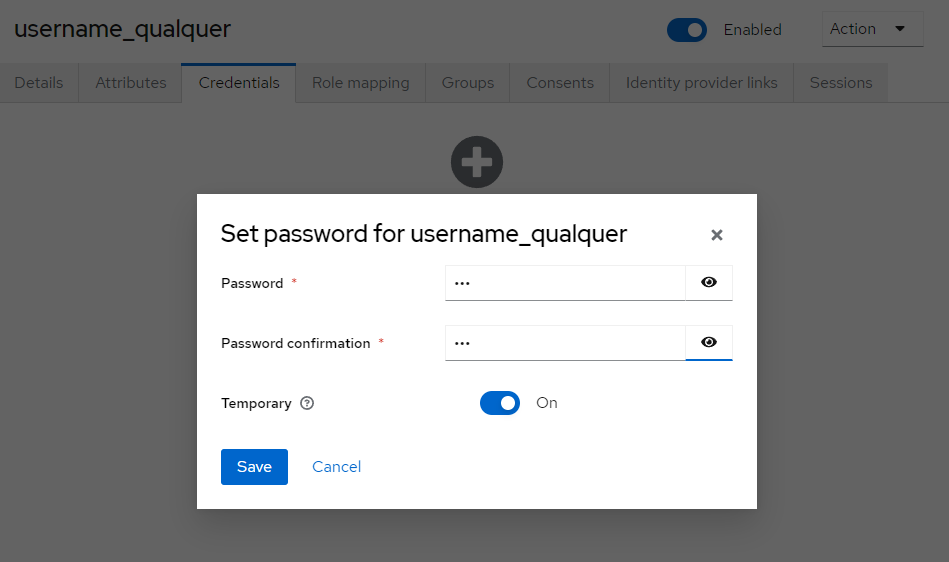

# Anotações sobre a ferramenta Keycloak

## Keep the basics

## OAuth 2.0

OAuth 2.0 é um protocolo de autorização amplamente utilizado na web para conceder acesso a recursos protegidos, sem a necessidade de compartilhar credenciais sensíveis, como senhas. Ele foi projetado para facilitar a integração segura entre diferentes aplicativos e serviços. O processo básico do OAuth 2.0 envolve três atores principais: o proprietário do recurso (usuário, resource owner), o cliente (aplicativo solicitante, client) e o servidor de autorização (auth server). O usuário concede permissões ao cliente para acessar seus recursos no servidor de autorização, que emite um token de acesso. Esse token é então enviado pelo cliente ao servidor de recursos para obter acesso aos dados protegidos.

Durante a autenticação, o cliente obtém um código de autorização do servidor de autorização após o usuário efetuar login e conceder permissões. Esse código é então trocado por um token de acesso. O OAuth 2.0 suporta diferentes fluxos de concessão, como o fluxo de autorização implícita, o fluxo de autorização de código e o fluxo de concessão de senha do proprietário. Cada um atende a diferentes cenários de uso, proporcionando flexibilidade na implementação. Além disso, o OAuth 2.0 não especifica o formato do token, permitindo a utilização de JSON Web Tokens (JWT) ou outros formatos, dependendo dos requisitos de segurança e implementação.

A principal vantagem do OAuth 2.0 é a capacidade de delegar permissões de acesso limitadas, sem a necessidade de compartilhar credenciais sensíveis. Isso melhora a segurança e a experiência do usuário, ao mesmo tempo em que facilita a integração entre serviços.

## OpenID Connect (OIDC)

O OpenID Connect (OIDC) é uma extensão do OAuth 2.0 e fornece uma camada de autenticação para o protocolo de autorização. Enquanto o OAuth 2.0 é focado na autorização e no acesso a recursos protegidos, o OpenID Connect visa fornecer um método padronizado para autenticar usuários, permitindo que clientes obtenham informações sobre a identidade do usuário autenticado. Em essência, o OpenID Connect adiciona uma camada de identidade ao OAuth 2.0.

No contexto do OpenID Connect, os três principais participantes (atores) são o usuário (proprietário do recurso), o cliente (aplicativo solicitante) e o provedor de identidade (servidor de autorização que suporta OIDC). O fluxo típico envolve o cliente autenticando o usuário no provedor de identidade, que então emite um token de ID (ID Token) contendo informações sobre a identidade do usuário, como nome, e-mail e outras informações específicas.

A relação entre o OAuth 2.0 e o OpenID Connect reside na maneira como esses protocolos podem ser usados em conjunto. O OpenID Connect é construído sobre o OAuth 2.0 e estende seus recursos para fornecer autenticação, enquanto ainda utiliza os conceitos de tokens de acesso do OAuth 2.0 para autorização. Isso significa que, ao utilizar o OpenID Connect, você também obtém os benefícios de autorização do OAuth 2.0, como a capacidade de conceder permissões específicas para acessar recursos protegidos.

Em resumo, o OpenID Connect aprimora o OAuth 2.0, proporcionando autenticação e informações de identidade, tornando-o uma escolha comum para implementações que exigem tanto autorização quanto autenticação em um único fluxo de interação com o usuário.

## O que é o Keycloak?

Patrocinado pela Red Hat, o Keycloak é um software open source de um servidor JBoss feito para trabalhar em conjunto com sua aplicação em implementações mais comuns de autenticação e de autorização. Links importantes:
(1) https://www.keycloak.org/
(2) https://quay.io/repository/keycloak/keycloak

Ao rodar o docker compose, se tudo deu certo, estaremos com um keycloak rodando e conectado a uma base mysql! Acessando a porta 8888 veremos a interface inicial do nosso keycloak:

Após login:


Crie um usuário na interface


Vamos ver no banco se o usuário está persistido:
Entre no bash do container "db"

```
docker compose exec db bash
```

Entrando no mysql

```
mysql -uroot -proot
```

Buscando os usuários atualmente cadastrados na base

```
use keycloak; select * from user_entity;
```

## Usuários e senhas

### Características

Caso você precise migrar usuários de outra base/autenticador para o Keycloak, saiba que:

- é necessário que os usuários estejam na base do Keycloak
- as senhas tem de ser compatíveis
- o Keycloak tem suporte a atributos extras para os usuários

Criando um usuário:


Adicionando um atributo extra ao usuário

Setando uma senha


Acima criamos um usuário de aplicação. Vamos agora criar um outro usuário administrativo!
Saiba que o client que o usuário precisa acessar
é este abaixo:

Criamos um usuário conforme imagem abaixo e logamos no client acima, ainda não temos, entretanto permissões suficientes para sermos considerados adms

Nossas roles: a default-roles-xxxx dá permissões básicas ao usuário

Como então resolver isso? Atribuiremos a role "admin" para o usuário novo
E veja só, o nosso usuário agora é um administrador


## Realms

Em Keycloak, um "realm" (em português, reino) é uma instância isolada e independente que contém configurações de segurança, usuários, grupos e clientes de aplicativos. Em termos simples, um realm é um espaço lógico e separado dentro do sistema Keycloak.

Cada realm em Keycloak opera de forma independente, com sua própria base de usuários, políticas de segurança e configurações específicas. Isso permite que organizações criem ambientes seguros e isolados para diferentes aplicativos, serviços ou partes de sua infraestrutura.

Criando um novo REALM:

Se você criou um usuário nesse novo REALM e quer que este usuário seja um admin nesse contexto, atribua a role realm-admin que é uma role composta, tal como a a imagem abaixo:


## Roles e Grupos

Bem, Roles são permissões(papel) do usuário, o que o usuário pode fazer no keycloak e/ou nas aplicações seguras pelo kc. As categorias de roles são:

1 - Realm Roles
2 - Client Roles

Vamos lembrar que 
access_token -> representa a autorização
id_token -> representa a autenticação

Gerando o access_token


Gerando o id_token
